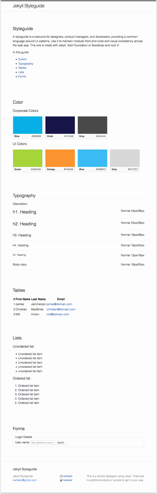

# Jekyll Styleguide

A styleguide is a resource for designers, product managers, and developers, providing a common language around UI patterns. Use it to maintain modular front-end code and visual consistency across the web app. This one is made with Jekyll. Add Foundation or Bootstrap and rock it!

This is a boilerplate styleguide made with Jekyll - no additional styling to get in your way.

It contains code for making swatches as well as starting points for:

- colors
- typography
- tables
- lists
- forms

You can find the source code for Jekyll at [github.com/jekyll/jekyll](https://github.com/jekyll/jekyll)

## Credits

Made by [Ken](http://kwhaler.com)

## License

The MIT License (MIT)

Copyright (c) 2016 Ken Whaler

Permission is hereby granted, free of charge, to any person obtaining a copy of this software and associated documentation files (the "Software"), to deal in the Software without restriction, including without limitation the rights to use, copy, modify, merge, publish, distribute, sublicense, and/or sell copies of the Software, and to permit persons to whom the Software is furnished to do so, subject to the following conditions:

The above copyright notice and this permission notice shall be included in all copies or substantial portions of the Software.

THE SOFTWARE IS PROVIDED "AS IS", WITHOUT WARRANTY OF ANY KIND, EXPRESS OR IMPLIED, INCLUDING BUT NOT LIMITED TO THE WARRANTIES OF MERCHANTABILITY, FITNESS FOR A PARTICULAR PURPOSE AND NONINFRINGEMENT. IN NO EVENT SHALL THE AUTHORS OR COPYRIGHT HOLDERS BE LIABLE FOR ANY CLAIM, DAMAGES OR OTHER LIABILITY, WHETHER IN AN ACTION OF CONTRACT, TORT OR OTHERWISE, ARISING FROM, OUT OF OR IN CONNECTION WITH THE SOFTWARE OR THE USE OR OTHER DEALINGS IN THE SOFTWARE.

